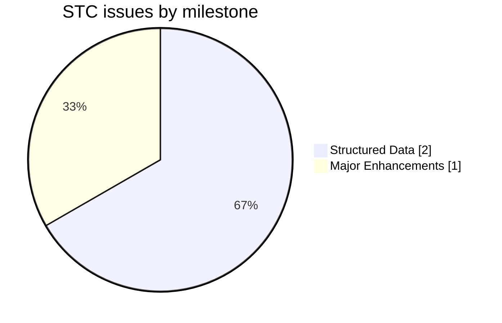
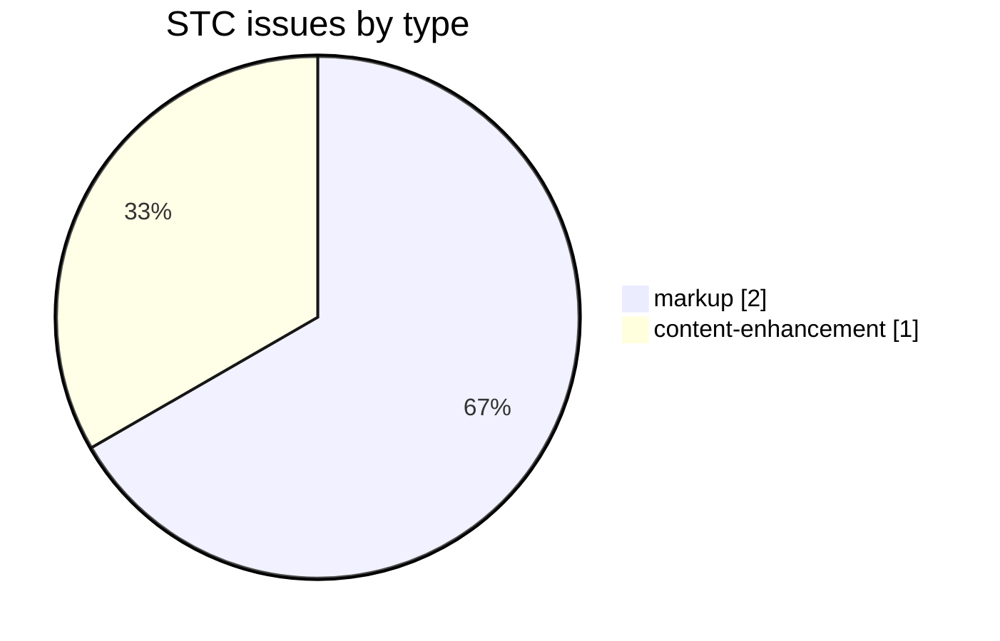
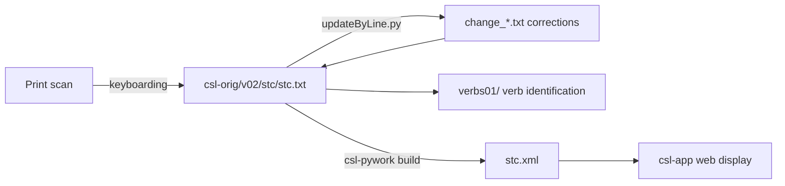

# STC — Stchoupak *Dictionnaire Sanscrit-Français* (1932)

Development and correction repository for **N. Stchoupak, L. Nitti and L. Renou's *Dictionnaire Sanscrit-Français***, a Sanskrit→French dictionary, part of the [Cologne Digital Sanskrit Lexicon](https://www.sanskrit-lexicon.uni-koeln.de/) (CDSL). The canonical source text lives in [`csl-orig/v02/stc/stc.txt`](https://github.com/sanskrit-lexicon/csl-orig/blob/master/v02/stc/stc.txt) (23,986 entries); this repository holds the development, correction, and enrichment work.

## Documentation

- [CLAUDE.md](CLAUDE.md) — repository guide and data-format reference.
- [DATA_DICTIONARY.md](DATA_DICTIONARY.md) — markup tag reference.
- [CONTRIBUTING.md](CONTRIBUTING.md) · [CODE_OF_CONDUCT.md](CODE_OF_CONDUCT.md)

## Contents

| Path | Purpose |
|---|---|
| `verbs01/` | Verb identification: maps verb entries to MW roots, with Devanāgarī renderings |

## Timeline

| Period | Activity |
|---|---|
| 2020 | Repository activity begins (first tracked issues) |
| 2023–2023 | Ongoing corrections, markup, and comparison work |
| 2026-05 | Issue taxonomy, citation metadata, documentation |

## Projects & Milestones

| Milestone | Open | Closed | Total |
|---|---|---|---|
| Dictionary to Book | 0 | 0 | 0 |
| Digitization Quality | 0 | 0 | 0 |
| Structured Data | 1 | 1 | 2 |
| Major Enhancements | 1 | 0 | 1 |
| **Total** | **2** | **1** | **3** |

**STC** = N. Stchoupak, L. Nitti & L. Renou, *Dictionnaire Sanskrit-Français* (Paris, 1932). Source language of the dictionary's apparatus and front matter is **French**.

## Contents

| Path | What |
|---|---|
| `verbs01/` | Verb data |
| `prefaces/` | Front-matter OCR (title page + *Avant-propos*) with English + Russian translations — see [Front matter](#front-matter-prefaces) below |

## Front matter (`prefaces/`)

Faithful OCR of the dictionary's front matter — the title page and the four-page *Avant-propos* (Foreword, incl. the abbreviation list) — transcribed verbatim in the **French** source, then translated into **English** and **Russian**. Sanskrit work-titles and transliterated forms are kept verbatim in all three languages; the Cologne digitizer header/footer stamps are omitted.

Cologne source scans: <https://sanskrit-lexicon.uni-koeln.de/scans/csldev/csldoc/build/dictionaries/prefaces/stcpref.html>

- Per-page files: `prefaces/stcprefNN.md` (French), `.en.md`, `.ru.md`.
- Consolidated editions: [stcpref_all.fr.md](prefaces/stcpref_all.fr.md) · [stcpref_all.en.md](prefaces/stcpref_all.en.md) · [stcpref_all.ru.md](prefaces/stcpref_all.ru.md), built by [build_combined.py](prefaces/build_combined.py).
- In-folder index: [prefaces/README.md](prefaces/README.md).

The *Avant-propos* is **unsigned and undated**; it closes with thanks to the Académie des Inscriptions et Belles-Lettres and to M. A. Foucher, and homage to the late É. Senart. The dictionary uses the older Lepsius-style romanisation (`ç` = ś, dotted retroflexes), preserved as printed.

<strong>OCR run notes (2026-06-22)</strong> — cost, timing, and technical lessons

Produced by the `/cologne-preface-ocr` skill (vision OCR + translation). Process retrospective, not part of the deliverable.

**Cost.** No subagents — all OCR and translation done synchronously in the main thread (5 pages × native-resolution crop reads + 5 pages × EN + RU). Main-thread estimate: ≈230k tokens (≈14 crop reads at 1500 px + 15 page-file writes + 3 combined files + READMEs). **Total ≈0.23 M tokens.**

**Time.** Wall-clock ≈12 min, single thread, gentle paced downloads (1–2 s between scans).

**Technical lessons (reusable):**
1. STC scans are served as **`.jpg`, not `.png`** (the skill's `_images/*.png` grep returns nothing — grep for `\.(jpg|png)`).
2. STC scans are **low-resolution** (750×1054 px, grayscale) — like the MW csldoc scans. The whole page is already under the 1900 px limit, but cropping into horizontal bands + a clean **2× upscale to 1500 px** (still under 2000) gives the clearest read; reading the full 750 px page risks fabrication.
3. Source is **French** with **Lepsius-style transliteration** (`ç`, dotted retroflexes) — keep verbatim, do not convert to IAST.
4. Front matter is short (title + 4 prose/abbreviation pages); no signature or date to hunt for.

## Issues

### Open

| # | Title | Type | Severity | Milestone |
|---|---|---|---|---|
| 1 | verbs01 | content-enhancement | medium | Major Enhancements |
| 2 | Abbreviations from 'ADDITIONS ET CORRECTIONS' | markup | minor | Structured Data |

### Solved

| # | Title | Type | Severity | Milestone |
|---|---|---|---|---|
| 3 | [markup] Minor stc.txt Markup Oddities | markup | minor | Structured Data |

## Labels

### Type labels

| Label | Meaning |
|---|---|
| `link-target` | Click-throughs from `<ls>` abbreviations to scanned PDF pages |
| `link-splitting` | Splitting combined `SOURCE N,N` refs into per-page links |
| `markup` | Normalising XML tag content |
| `text-correction` | Corrections to French/Sanskrit definitions or headwords |
| `content-enhancement` | New material or structural additions beyond correction |
| `encoding` | SLP1/IAST transcoding, character normalisation |
| `scan-quality` | Replacing blurry/skewed/missing scan pages |
| `bug` | Broken links, XML errors, broken downloads |
| `question` | Scholarly questions requiring research |

### Severity labels

| Label | Meaning |
|---|---|
| `minor` | Targeted fix — a handful of lines or a single file |
| `medium` | Standard unit of work — one batch of corrections |
| `hard` | Large effort spanning many sources or files |

## Contributors

| Contributor | Commits |
|---|---|
| gasyoun (Mārcis Gasūns) | 8 |
| funderburkjim | 2 |

## Source

- **Author**: Stchoupak, N.; Nitti, L.; Renou, L.
- **Title**: *Dictionnaire Sanscrit-Français*
- **Place / Publisher**: Paris: Adrien-Maisonneuve
- **Year(s)**: 1932
- **Language pair**: Sanskrit → French
- **Size (CDSL headword index)**: 23,986 entries
- **License (digital edition)**: CC BY-SA 4.0
- See [CITATION.cff](CITATION.cff) for machine-readable citation.

## Encoding

- UTF-8 (NFC) throughout.
- Sanskrit text in SLP1 transliteration, wrapped in `{#…#}`; French gloss / italic display text in ``.
- Devanāgarī and IAST display forms are generated at display time, not stored in the source.

## How it works

---
*Issue taxonomy and documentation per the [Cologne issue runbook](https://github.com/sanskrit-lexicon/csl-observatory/blob/main/runbook/cologne-issue-runbook.md).*
